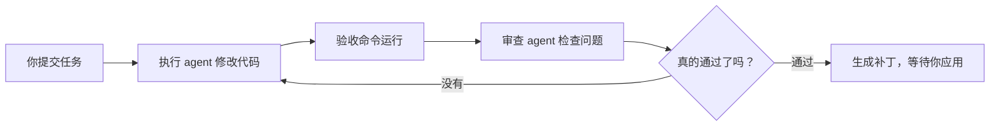

# Verdikt

Verdikt 是一个本地控制台，用来把一个编码 agent 和一个审查 agent 串成闭环：一个负责执行任务，另一个负责挑错和确认，最后再用你的验收命令判断是否真的完成。

它的核心目标很直接：减少“看起来完成了，其实没完成”的情况，让你不用一直盯着终端。

## 第一次打开推荐流程

Verdikt 的执行依赖 Claude Code。首次使用前需要准备 Node.js 20 以上、Git、pnpm 和 Claude Code。Claude Code 官方安装说明：<https://code.claude.com/docs/en/setup>。

```bash
pnpm install
pnpm app
```

启动后会自动打开浏览器。如果你不想自动打开，可以用：

```bash
pnpm app:no-open
```

Windows 也可以直接运行：

```powershell
.\scripts\start-verdikt-app.ps1
```

浏览器打开控制台后：

1. 打开 **模型与连接**。
2. 选择 Claude 账号，或填写兼容 Anthropic API 的服务地址、凭据和模型名称。
3. 点 **保存并测试连接**。测试会发出一个很小的真实请求，提前确认账号、额度、地址和模型都可用。
4. 回到 **新任务**，点 **填入示例**。
5. 点 **预览配置**，确认示例项目和自动识别的验收方式。
6. 点 **开始执行任务**。
7. 运行结束后先看 **查看修改** 和 **查看完整结果**，满意再应用。

使用第三方模型时仍然需要安装 Claude Code。第三方服务必须兼容 Anthropic API；只有 OpenAI 格式的接口不能直接使用，需要先经过兼容网关转换。

默认不会改原项目。Verdikt 会先在隔离副本里工作，只有你明确点 **应用修改**，改动才会写回原项目。

目标仓库需要处于干净状态（没有未提交的改动），否则任务会在开始前被拒绝——这样可以避免跑完之后补丁无法应用。先提交或 stash 改动即可；确需强制继续时可在任务中设置 `allowDirtyRepo`（命令行 `--allow-dirty`），通过后的补丁需手动应用。

## 现在能做什么

- **任务工作台**：正在跑、排队中、历史记录、可继续的任务都集中显示。
- **模型与连接设置**：在页面里选择模型、配置兼容服务并实际测试连接。
- **项目自动准备**：从本机选择项目文件夹，自动检查 Git 状态并识别测试、检查和构建方式。
- **排队运行**：一次只跑一个任务，后续任务自动排队，不会互相抢终端。
- **失败后给下一步**：失败时会告诉你更适合继续、重试、查看日志，还是调整任务。
- **查看修改**：任务通过后可以直接看改了哪些文件、增删了多少、补丁内容是什么。
- **继续和重试**：中断的任务可以继续；失败的任务可以用同样目标重新尝试。
- **多阶段任务**：复杂任务可以拆成“诊断、修复、验收”等节点，让执行更稳。
- **双 agent 视图**：详情页按轮次展示执行 agent 做了什么、审查 agent 发现了什么。
- **完成通知**：浏览器允许通知后，任务结束会提醒你。
- **完整时间线**：从开始、规划、执行、验收、审查到结束都按顺序保存，重启后仍能查看。
- **下一轮补充说明**：运行中可以先写补充要求，它会在下一轮安全生效，不会打断当前步骤。
- **回到某一轮或创建新尝试**：保留原任务的同时，可以从历史轮次换一个方向继续。
- **具体操作确认**：发布、删除、生产写入等危险动作会展示具体命令，可只允许一次或允许本次运行。
- **可选只读规划**：复杂任务可先生成方案，必要时等你确认后再开始修改。
- **真实花费状态**：拿不到完整数据时明确显示“未知”或“部分”，不再把缺失数据当成零。
- **项目检查扩展**：可以在关键节点运行项目内的检查脚本，选择提醒或阻止继续。

## 适合什么场景

Verdikt 适合这类任务：

- 修复一个明确的测试失败。
- 让 agent 实现一个小到中等规模的新功能。
- 对一个改动反复执行“修改、验收、审查、再修改”。
- 你想把 agent 放着跑，但又不想完全相信它自己说“完成了”。

不适合这类任务：

- 没有验收命令、也没有清楚完成标准的开放式探索。
- 会直接影响生产环境、密钥、支付、数据库迁移的高风险任务。
- 需要人持续做产品判断或视觉判断的大改版。

## 基本工作方式



Verdikt 不把 agent 的自我描述当最终结果。验收命令、审查结论和补丁记录会一起决定任务是否完成。

## 命令行

| 命令 | 用途 |
| --- | --- |
| `pnpm app` | 构建并打开 Web 控制台 |
| `pnpm app:no-open` | 构建并启动控制台，但不自动打开浏览器 |
| `node dist/index.js app --port=3849` | 指定端口启动控制台 |
| `node dist/index.js run --task task.json` | 直接从命令行运行任务 |
| `node dist/index.js list` | 查看历史运行 |
| `node dist/index.js view <run-id>` | 打开某次运行详情 |
| `node dist/index.js resume <run-id>` | 继续一次中断的运行 |
| `node dist/index.js apply <run-id>` | 把通过的补丁应用回原项目 |
| `node dist/index.js discard <run-id>` | 丢弃一次运行的隔离副本 |
| `node dist/index.js doctor` | 检查本机环境 |
| `node dist/index.js note <run-id> "说明"` | 给下一轮加入补充说明 |
| `node dist/index.js rewind <run-id> <轮次>` | 回到某一轮继续 |
| `node dist/index.js fork <run-id> <轮次>` | 从某一轮创建独立的新尝试 |
| `node dist/index.js warm <repo-path>` | 提前准备下一次运行的干净隔离副本 |

## 任务文件示例

```json
{
  "id": "fix-sum",
  "goal": "Fix the sum function so it correctly adds two numbers.",
  "stages": [
    {
      "id": "diagnose",
      "title": "诊断",
      "goal": "确认失败测试和错误函数"
    },
    {
      "id": "fix",
      "title": "修复",
      "goal": "修改实现并保持测试不变"
    },
    {
      "id": "verify",
      "title": "验收",
      "goal": "运行测试并等待审查 agent 通过"
    }
  ],
  "repoPath": "./examples/demo-failing-test",
  "acceptance": {
    "steps": [
      { "id": "test", "command": "npx", "args": ["vitest", "run"] }
    ]
  },
  "maxIterations": 5,
  "maxBudgetUsd": 5,
  "integrity": {
    "allowTestChanges": false
  },
  "semantic": {
    "maxRisk": "low"
  },
  "planning": {
    "mode": "auto",
    "requireApproval": false
  },
  "hooks": [
    {
      "event": "before_run",
      "script": "examples/hooks/allow.cjs",
      "failureMode": "block",
      "timeoutMs": 15000
    }
  ]
}
```

## 产物在哪里

每次运行都会记录在 `.verdikt/<run-id>/` 下面，常见内容包括：

- `summary.json`：这次运行的总结果。
- `iterations.jsonl`：每一轮执行、验收、审查记录。
- `events.jsonl`：完整运行时间线。
- `plan.md`：开始前生成的方案（如果启用）。
- `notes.json`：等待下一轮使用的补充说明。
- `checkpoints/`：每轮可回退的保存点。
- `action-approvals.json`：具体危险操作的确认记录。
- `evidence/final.patch`：最终补丁。
- `task.json`：当时使用的任务配置。

## 开发

```bash
pnpm install
pnpm build
pnpm test
pnpm lint
```

项目还在快速产品化阶段。现在的重点是把“双 agent 闭环”做成一个真正能日常使用的软件，而不是只停留在命令行原型。
## 长任务、重启与恢复

工作台会把排队、运行、等待确认和可恢复状态保存到 `.verdikt/queue.json`。正常关闭工作台时，正在执行的任务会先保存现场；再次启动后，排队任务会自动继续，可恢复任务也会重新进入队列。主动点击“停止运行”仍然表示真正取消，并会按取消规则清理现场。

Windows 推荐用下面的脚本启动。服务异常退出时默认会自动重启：

```powershell
.\scripts\start-verdikt-app.ps1 -NoOpen
```

如果不希望自动重启：

```powershell
.\scripts\start-verdikt-app.ps1 -NoRestart
```

macOS 或 Linux 可以运行：

```bash
sh scripts/start-verdikt-app.sh
```

## 高风险确认与证据校验

遇到部署、生产环境、数据库、密钥、外部写入、破坏性操作或项目外操作时，Verdikt 会先暂停。你可以在工作台里批准或拒绝，也可以使用命令：

```bash
node dist/index.js approve <run-id>
node dist/index.js reject <run-id>
node dist/index.js verify-evidence <run-id>
```

批准后会从保存的现场继续；拒绝后会让运行安全收尾。Verdikt 还会在执行过程中拦截临时出现的高风险命令，避免 agent 绕过任务开始前的确认。

每次运行会生成 `evidence/manifest.json`。它记录关键文件的指纹和运行环境。应用或丢弃补丁后清单会自动更新；文件被改动或删除时，校验会明确列出问题。

## 可重复对比测试

Benchmark 套件支持 `repeats`、`warmups` 和 `failFast`。重复运行会保留每次尝试，并报告通过率、中位耗时、最差耗时、波动、总花费、不稳定任务、模型和提交版本。
## 规划、补充说明与回退

- 控制台里的“开始前先规划”可以关闭、自动开启，或要求先确认方案。
- 运行中填写“下一轮补充说明”，内容只会在下一轮开始时使用一次。
- 输入轮次后可以回到该轮继续，或从该轮创建一个独立的新尝试。
- 完整时间线会持续追加，不依赖页面一直打开。

命令行示例：

```bash
node dist/index.js note <run-id> "不要改接口，优先修复缓存失效"
node dist/index.js rewind <run-id> 2
node dist/index.js fork <run-id> 2
```

## 项目检查扩展

任务文件可以配置项目内的 JavaScript 检查脚本。脚本只能放在目标项目内，可在运行前、规划后、执行后、验收后、应用修改前或运行结束后触发。完整示例见 `examples/advanced.task.json` 和 `examples/hooks/allow.cjs`。

## 工作区预备

如果大型项目创建隔离副本较慢，可以先运行：

```bash
node dist/index.js warm D:\project\my-app
```

下一次运行会在项目版本未变化、预备副本仍然干净时使用它；否则自动改用普通创建方式。每次运行都会记录准备耗时。
