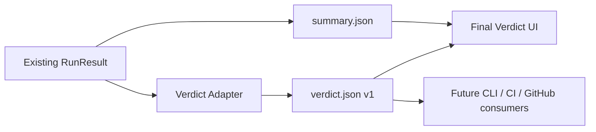

# Verdikt Result Foundation 设计

日期：2026-07-28

## 目标

Verdikt 的核心对象是一个待验收的软件变更，而不是执行这个变更的 Agent。

本阶段新增统一、带版本号的最终判定结果，并让最终判定页优先消费它。现有执行循环、`summary.json`、历史记录和 Agent 调用方式保持兼容。

本阶段完成后：

- 每个新运行都会产生 `verdict.json`。
- `PASS` 有严格且可依赖的含义，不再附带习惯性的人工兜底。
- Web 最终判定页首先回答结果、依据和下一步。
- CLI、Web UI、未来的 CI 和 GitHub 接入可以消费同一份结果。
- 旧运行没有 `verdict.json` 时仍能使用现有 `summary.json` 页面。

## 非目标

本阶段不做：

- `verdikt check`
- Codex 执行器
- 验收合同向导
- 当前任务页重做
- WebSocket
- 远程访问
- 桌面封装
- 旧记录批量迁移
- 重构现有执行循环

## 总体方案



`verdict.json` 是新的稳定结果合同。`summary.json` 继续承担旧功能和兼容职责。

新页面按以下顺序读取：

1. 读取并校验 `verdict.json`。
2. 文件不存在时，使用现有 `summary.json` 渲染旧页面。
3. 文件存在但损坏或版本不支持时，显示 `INCOMPLETE`，不得回退成可能误导用户的通过结果。

## 判定与运行状态

运行是否结束和软件变更是否通过是两个不同问题。

### 判定状态

```ts
type VerdictStatus = "pass" | "fail" | "needs_review" | "incomplete";
```

- `pass`：所有必需条件通过；没有阻断性的范围、完整性或证据问题。
- `fail`：至少一项必需条件明确失败，或存在阻断性的范围或完整性问题。
- `needs_review`：验证已经完成，但至少一项必需判断只能由人完成。
- `incomplete`：证据不足或运行没有完成，无法形成可靠结论。

### 运行状态

原有 `StopReason` 保留在结果内，用来解释为什么运行结束。

取消、中断、预算耗尽、无进展和服务错误默认映射为 `incomplete`，而不是 `fail`。这避免把“运行没有完成”误报成“软件修改已被证明失败”。

## 数据合同

```ts
interface VerdictResult {
  version: 1;
  run: VerdictRun;
  status: VerdictStatus;
  summary: VerdictSummary;
  recommendation: VerdictRecommendation;
  scope: VerdictScope;
  criteria: VerdictCriterion[];
  integrity: VerdictIntegrity;
  evidence: VerdictEvidence[];
  findings: VerdictFinding[];
  provenance: VerdictProvenance;
  createdAt: string;
}
```

### 运行信息

```ts
interface VerdictRun {
  runId: string;
  taskId?: string;
  goal?: string;
  repoPath?: string;
  stopReason: StopReason;
  applyStatus?: "applied" | "discarded" | "pending";
  totalDurationMs: number;
  totalCostUsd?: number;
  usageStatus: UsageStatus;
}
```

### 总结与建议

```ts
interface VerdictSummary {
  title: string;
  explanation: string;
  requiredPassed: number;
  requiredTotal: number;
}

type VerdictRecommendation =
  | "accept_change"
  | "continue_fixing"
  | "human_review"
  | "discard"
  | "none";
```

结果合同使用 `accept_change`，页面再根据上下文显示“应用修改”或“合并”。这样结果不绑定某个 GitHub 或本地补丁流程。

### 验收条件

```ts
type VerdictCheckStatus =
  | "pass"
  | "fail"
  | "needs_review"
  | "warning"
  | "skipped";

interface VerdictCriterion {
  id: string;
  name: string;
  description?: string;
  required: boolean;
  status: VerdictCheckStatus;
  summary: string;
  evidenceIds: string[];
}
```

规则：

- 必需条件 `fail` 时，总体不能为 `pass`。
- 必需条件 `needs_review` 时，总体为 `needs_review`。
- `warning` 只用于非阻断问题。
- `skipped` 必须说明原因，不能伪装成通过。
- Agent 自述不能单独让必需条件通过。

### 证据

```ts
type VerdictEvidenceSource =
  | "verified_execution"
  | "diff_inspection"
  | "independent_review"
  | "agent_claim"
  | "user_confirmation";

type VerdictEvidenceAssurance = "verified" | "attested" | "claimed";

type VerdictEvidenceKind =
  | "command"
  | "test"
  | "build"
  | "lint"
  | "diff"
  | "file"
  | "review"
  | "artifact"
  | "claim";

interface VerdictEvidence {
  id: string;
  kind: VerdictEvidenceKind;
  source: VerdictEvidenceSource;
  assurance: VerdictEvidenceAssurance;
  title: string;
  summary: string;
  command?: {
    executable: string;
    args: string[];
    exitCode: number;
    durationMs: number;
  };
  artifactPath?: string;
  timestamp?: string;
}
```

含义：

- `verified`：Verdikt 直接执行或检查得到。
- `attested`：用户或独立审查给出的判断。
- `claimed`：执行 Agent 的自述，没有独立验证。

大段输出不写入 `verdict.json`。结果只保存短摘要和证据文件路径，完整输出继续保存在现有运行记录中。

### 修改范围

```ts
interface VerdictScope {
  status: VerdictCheckStatus;
  expectedPaths: string[];
  changedFiles: string[];
  outOfScopeFiles: string[];
  filesChanged: number;
  linesAdded?: number;
  linesDeleted?: number;
}
```

现有任务没有声明允许范围时，范围状态为 `skipped`，不得自动声称“没有越界修改”。第一版仍展示实际修改文件。

### 完整性

```ts
interface VerdictIntegrity {
  status: VerdictCheckStatus;
  testsModified: boolean | null;
  acceptanceWeakened: boolean | null;
  evidenceRecorded: boolean;
  criticalCount: number;
  warningCount: number;
  findings: VerdictFinding[];
}
```

`null` 表示当前数据无法得出结论。完整性检查被关闭或没有运行时，不得显示为通过。

### 发现与来源

```ts
interface VerdictFinding {
  id: string;
  severity: "critical" | "high" | "medium" | "low";
  title: string;
  detail: string;
  file?: string;
  line?: number;
  recommendation?: string;
  evidenceIds: string[];
}

interface VerdictProvenance {
  baseCommit?: string;
  resultCommit?: string;
  evidenceManifestPath?: string;
  verdiktVersion?: string;
}
```

## 状态映射

适配器使用以下优先顺序：

1. 运行没有完成：`incomplete`。
2. 存在阻断性的完整性问题：`fail`。
3. 必需命令失败：`fail`。
4. 必需判断只能由人完成：`needs_review`。
5. 所有必需条件通过：`pass`。

第一版现有实现中，客观验收命令是最终通过的主要依据。Verifier 或 Reviewer 的模型结论作为补充证据，不会覆盖失败的命令结果。

建议动作：

- `pass` -> `accept_change`
- `needs_review` -> `human_review`
- `fail` 且仍可继续 -> `continue_fixing`
- 阻断性完整性问题或已明确丢弃 -> `discard`
- `incomplete` 且可恢复 -> `continue_fixing`
- 其他无法行动的情况 -> `none`

## 保存与兼容

`writeSummary` 继续写入 `summary.json`，并调用纯函数把同一个 `RunResult` 和保存的任务映射为 `VerdictResult`，再原子写入 `verdict.json`。

这样可以：

- 不修改所有现有调用点。
- 确保两个结果来自同一份内存数据。
- 保持每个文件自身写入完整，进程中断时不会产生半个 JSON 文件。

`verdict.json` 加入证据清单的候选文件列表。新运行创建清单时会记录它的哈希；旧运行不要求存在该文件。

## 统一读取入口

本地工作台增加只读结果入口：

```text
GET /api/verdict/:runId
```

返回：

- 新运行：已校验的 `VerdictResult`。
- 旧运行：`404` 并标记为 legacy，由页面使用原有数据。
- 文件损坏或版本不支持：明确错误，不能静默回退成通过。

独立运行报告服务允许读取 `verdict.json`，页面优先加载它。

## 最终判定页

采用“判定优先的单列报告”。

### 第一屏

```text
PASS

可以接受这项修改
所有 8 项必需验收条件均已通过，
未发现阻断性的范围或完整性问题。

[查看修改] [应用修改]
```

只有总体状态为 `pass` 时才显示“可以接受”。

`needs_review` 必须明确显示需要判断的具体项目；不能同时显示 PASS。

### 内容顺序

1. 总体判定、解释和建议动作
2. 验收条件
3. 修改范围
4. 完整性
5. 修改文件
6. “查看证据与运行记录”展开入口

证据展开区域包括：

- 命令摘要和退出码
- 完整输出文件入口
- 差异
- 审查报告
- 时间线
- 证据清单
- Agent 自述

默认视图不展示原始日志。

### 视觉来源

- A：最终判定页
- B：证据与审计详情
- C：未来运行中任务中心

## 错误处理

- 结果文件不存在：使用旧页面。
- 结果文件不是合法 JSON：显示 `INCOMPLETE` 和明确错误。
- `version` 不受支持：显示 `INCOMPLETE`，不猜测字段含义。
- 引用的证据不存在：对应条件不能显示为已验证。
- 必需条件没有可信证据：总体不能为 `pass`。
- 未知字段允许保留，已知字段必须严格校验。

## 测试

### 单元测试

- 每种 `StopReason` 的状态映射。
- 必需和可选条件的通过、失败、跳过。
- Agent 自述不能产生 PASS。
- 完整性问题优先于命令通过。
- 建议动作映射。
- 证据 ID 与验收条件引用一致。
- 大段输出不会写入结果文件。

### 集成测试

- `writeSummary` 同时生成两个结果文件。
- `verdict.json` 使用原子写入。
- 证据清单包含新结果文件。
- 结果接口返回合法数据。
- 损坏文件和不支持版本返回明确错误。
- 旧记录仍可读取。

### 页面测试

- PASS 页面显示“可以接受”且不显示习惯性人工兜底。
- NEEDS REVIEW 页面不显示 PASS。
- FAIL 页面突出失败条件。
- INCOMPLETE 页面不误报软件失败。
- 证据来源清楚区分真实执行、审查和 Agent 自述。
- 详细日志默认折叠。
- 桌面和手机宽度无重叠、截断或按钮溢出。

## 风险控制

这次修改涉及长期保存的共享结果合同。

控制措施：

- 新增文件而不是替换旧文件。
- 固定 `version: 1`。
- 不迁移旧记录。
- 保留旧页面作为兼容路径。
- 非法或不完整数据采用失败关闭，不显示 PASS。
- 先通过适配器生成，不重构执行引擎。

## 交付标准

- 新运行生成合法的 `verdict.json`。
- 现有 `summary.json` 内容和调用者保持兼容。
- 最终判定页采用 A 方案，并使用新结果文件。
- 旧运行仍能打开。
- 所有新增和现有相关测试通过。
- 构建、代码检查和浏览器实际操作验证通过。
